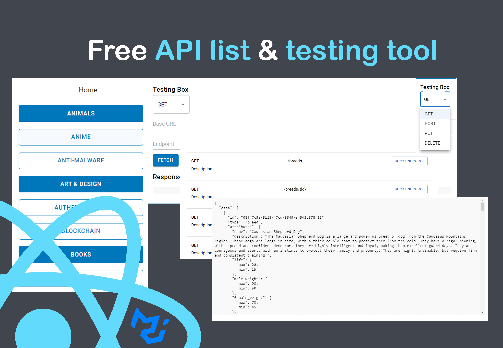

# Free API List with React

Welcome to the Free API List with React project! This open source project aims to provide a comprehensive list of free APIs along with tools to test and explore them. The project is built using React, and it allows users to discover and learn about various APIs available for different purposes.

## Features

- **API Listings**: Browse through a curated collection of free APIs across different categories.
- **Documentation**: Access detailed information and documentation about each API, including endpoints, request parameters, and response formats.
- **API Testing**: Utilize built-in tools to test and experiment with the APIs directly from the project.
- **Contribution**: Contribute to the project by adding new APIs, improving documentation, or enhancing the testing tools.

## Live Demo

Explore the live demo of the Free API List with React project hosted on GitHub Pages: [GitHub Pages Demo](https://curtis-thomas.github.io/free-api-list-with-react/)

## Getting Started

To run the project locally and contribute, follow these steps:

1. Clone the repository: `git clone https://github.com/curtis-thomas/free-api-list-with-react.git`
2. Install dependencies: `npm install`
3. Start the development server: `npm start`

## Contributing

Contributions are welcome and greatly appreciated! If you would like to contribute to the project, please follow the guidelines in the [Contributing](CONTRIBUTING.md) document.

## License

This project is licensed under the [MIT License](LICENSE).

## Contact

If you have any questions, suggestions, or feedback, please feel free to reach out to the project maintainer.

---

Thank you for your interest in the Free API List with React project. We hope you find it useful and contribute to its growth and improvement!
