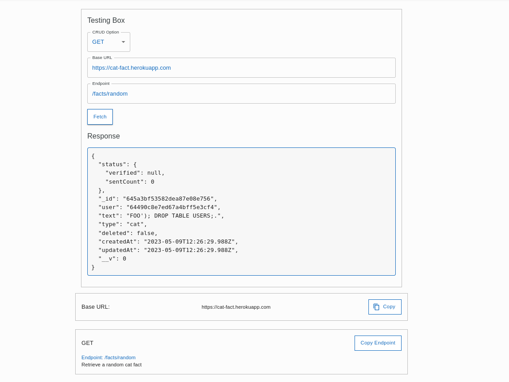

# Free API List with React

Welcome to the Free API List with React project! This open source project aims to provide a comprehensive list of free APIs along with tools to test and explore them. The project is built using React, and it allows users to discover and learn about various APIs available for different purposes.

### Features

#### **API Listing**

Explore a diverse selection of APIs spanning various types and applications, providing a comprehensive array of valuable services for your projects.

- Enjoy a user-friendly interface designed for effortless comprehension and usability, making it simple to navigate and explore the available APIs.
- Benefit from a categorized listing that streamlines the process of discovering the ideal API for your specific needs.
- APIs are classified based on application difficulty levels, ranging from beginner-friendly complexities to challenging applications, suitable even for experienced developers.

#### **Easy access to APIs Documentation**

Aiming to simplify the process of finding the documentation for a desired API, FREE API List provides the documentation right at the beginning of each API page, right above its description.

- Access the documentation with a single link that will direct you to the official API page.
- Obtain detailed information about each API more easily, including endpoints, request parameters, and response formats.

#### **API Testing**

Experience a streamlined testing interface that enables the execution of fundamental functionalities for each API.

- Effortless invocation of GET, POST, PUT, and DELETE functions.
- View responses in the JSON format provided by the API itself.
- Accessible Base URLs and Endpoints simplify and expedite the functionality testing process.

### Live Demo

Explore the live demo of the Free API List with React project: [Free API List](https://freeapilist.com/)

### Contributing

Contributions are welcome and greatly appreciated! If you would like to contribute to the project by adding new APIs, improving documentatio or enchancing the testing tools, please follow the guidelines in the [Contributing](CONTRIBUTING.md) document.

### License

This project is licensed under the [MIT License](LICENSE).

### Contact

If you have any questions, suggestions, or feedback, please feel free to reach out to the project maintainer.

---

Thank you for your interest in the Free API List with React project. We hope you find it useful and contribute to its growth and improvement!
